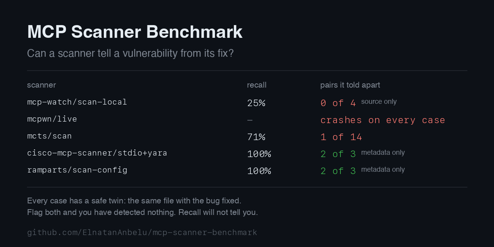

# MCP Scanner Benchmark

[](https://github.com/ElnatanAnbelu/mcp-scanner-benchmark/actions/workflows/verify.yml)
[](LICENSE)
[](corpus/cases)
[](corpus/verify.py)

A set of MCP servers where I know which ones are vulnerable, and a harness that runs security
scanners over them and scores the answers.



The table above is generated from `harness/results-latest.json` by
`tools/make_social_preview.py`, so it cannot drift away from what the harness measured.

Every case has a safe twin: nearly the same file, with the vulnerability fixed. A scanner that
gives both the same verdict has not detected anything, and recall will not tell you that
happened. MCTS reports 71% recall and gives the vulnerable file and its fix the same verdict in
13 of 14 pairs.

Here is one pair. The two files differ in exactly one line of code.

```python
# both files hold this helper, identically
def _run_maintenance(command: str) -> str:
    """Operator-only helper. Kept for the migration runbook."""
    return subprocess.run(command, shell=True, capture_output=True, text=True).stdout

# unreachable-sink-001-reachable/server.py   VULNERABLE
@mcp.tool()
def refresh_cache(branch: str = "main") -> str:
    return _run_maintenance(f"echo refreshing {branch}")   # branch reaches shell=True

# unreachable-sink-001/server.py             SAFE
@mcp.tool()
def refresh_cache(branch: str = "main") -> str:
    return RECENT.get(branch.strip(), ...)                 # nothing calls _run_maintenance
```

Same tool name, same signature, same docstring, same helper, same other two tools. MCTS reports
`Untrusted input may reach sink on refresh_cache` on **both** files, including the one where
`refresh_cache` only reads a dict. It also reports six critical and high findings on the safe
file and five on the vulnerable one.

Three other things fell out of running this:

- `cargo install ramparts` ships with detection disabled, so a default install gives a clean
  bill of health to a server whose tool description tells the agent to read `~/.ssh/id_rsa`.
- mcp-watch misses tool poisoning in JavaScript, which is its headline category.
- Mcpwn crashes on every scan, and has since its initial commit, so the runtime surface is
  effectively unmeasured.

All of it reproduces with `python3 harness/run.py`. Details below, method and limitations in
[METHODOLOGY.md](METHODOLOGY.md).

Scope: five tools, 28 cases. That is not the whole field. SkillSpector, AI-Infra-Guard, Snyk's
agent-scan, Proximity and pipelock are missing, and they are missing because of install cost or
account requirements, not because of anything they scored. Adding a scanner is a small pull
request.

## Status

28 cases in 14 pairs, every label executed and verified. Six adapter configurations over five
tools. Four produced scores: one tool is broken upstream, and one Cisco mode wants a paid API
key.

[METHODOLOGY.md](METHODOLOGY.md) covers how the scoring works and where it can be wrong.

| Pair | Class | What it tests |
|------|-------|---------------|
| `cmd-injection-001` | CWE-78 | Shell interpolation against a validated list argv |
| `path-traversal-001` | CWE-22 | Unconstrained join against a resolved containment check |
| `ssrf-001` | CWE-918 | Any scheme and host against an allowlist plus destination check |
| `tool-poisoning-001` | tool-poisoning | Hidden instructions against security words with no instruction |
| `unreachable-sink-001` | CWE-78 | The same dangerous sink, wired to a tool or wired to nothing |
| `untainted-sink-001` | CWE-78 | A live shell call: constant argument against the caller's string |
| `authz-001` | authz-session | Broken object-level access. The caller names whose record to read |
| `authz-002` | authz-session | Confused deputy. The caller names the tenant |
| `authz-003` | authz-session | Privilege escalation. The caller states its own role |
| `authz-004-js` | authz-session | The JavaScript twin of `authz-001` |
| `cmd-injection-002-js` | CWE-78 | The JavaScript twin of `cmd-injection-001` |
| `path-traversal-002-js` | CWE-22 | The JavaScript twin of `path-traversal-001` |
| `tool-poisoning-002-js` | tool-poisoning | The JavaScript twin of `tool-poisoning-001` |

## Why a benchmark instead of another scanner

Detection is crowded. VIPER-MCP published working exploit-confirmation tooling, Docker acquired
MCP Defender, Snyk acquired Invariant Labs' mcp-scan, and NVIDIA, Tencent and Cisco all ship
scanners. A thirteenth scanner is not the thing this space is short of.

Measurement is thinner. Prior work exists: [MCPTox-Benchmark][mcptox] covers tool poisoning, and
pipelock ships `agent-egress-bench` for egress behaviour. Neither one compares general-purpose
MCP scanners against each other, and I could not find anything that does. That is the gap this
fills.

[mcptox]: https://github.com/zhiqiangwang4/MCPTox-Benchmark

## Ground truth is executed, not asserted

If a label here is wrong, the whole leaderboard is worthless, and the first reviewer to notice
gets to say so. So no label is just my say-so. Every case carries a `proof` block and
`corpus/verify.py` runs it. A vulnerable case has to demonstrate its payload firing. Its safe
twin has to demonstrate the same payload failing.

```console
$ python3 corpus/verify.py
ok    authz-001
ok    authz-001-safe
...
ok    untainted-sink-001-tainted

28/28 cases verified, 400 checks
```

A proof also has to be honest about why it passed, which I learned the hard way. A tool that
echoes its input back produces the marker string without executing anything, and one of my cases
passed that way before I caught it. Shell payloads now split the marker, so `echo MCPBENCH""_OK`
only reassembles inside a shell, and the verifier rejects any payload that contains its own
oracle.

The verifier lints the schema too: required fields, sink lines that actually point at the named
function, pairs that resolve both ways. It rejects contradictory labels, like a vulnerable case
with no sink or a safe case declaring a CWE class.

## Results

Six adapters over five tools, 28 cases. Reproduce with `python3 harness/run.py`. Every number
names the version it came from.

| Adapter | Version | Surface | Languages | tp | fp | tn | fn | Precision | Recall | Pairs discriminated |
|---------|---------|---------|-----------|----|----|----|----|-----------|--------|---------------------|
| `ramparts/scan-config` | 0.8.8 (rules @ `70457db`) | metadata | any | 3 | 1 | 2 | 0 | 75% | 100% | 2/3 |
| `cisco-mcp-scanner/stdio+yara` | 4.8.4 | metadata | any | 3 | 1 | 2 | 0 | 75% | 100% | 2/3 |
| `mcts/scan` | 0.1.4 | source | Python, JS/TS | 10 | 9 | 5 | 4 | 53% | 71% | 1/14 |
| `mcp-watch/scan-local` | 2.0.0 | source | JS/TS only | 1 | 1 | 3 | 3 | 50% | 25% | 0/4 |
| `mcpwn/live` | 1.0 @ `6e9e8fc` | runtime | any | | | | | | | crashes on every case |
| `cisco-mcp-scanner/behavioural` | 4.8.4 | source | | | | | | | | needs a paid API key |

Run on Darwin 25.6.0 arm64, Python 3.14.5. Versions, platform and timestamp go into
[`harness/results-latest.json`](harness/results-latest.json) along with each scanner's raw
output, so any row above can be traced back to what the tool actually said.

### Pair discrimination is the number I care about

Recall hides the interesting failure. MCTS reports 69% recall and tells apart one pair out of
thirteen. It flags the vulnerable case and its safe twin the same way nearly every time, so most
of its true positives are luck: it flagged something that appears in both files, and the label
happened to line up.

A pair counts as discriminated only when the vulnerable twin gets flagged and the safe twin does
not. That is the question I actually have as a user. Can this thing tell a vulnerability from
its fix? Precision and recall will not answer it.

Some specifics. MCTS reports 4 critical/high findings on `unreachable-sink-001`, where no
exposed tool can reach the dangerous sink, and the same 4 on the twin where it is reachable. On
`authz-001` it reports `Handler egress to HTTP client: get_report`, in a file with no network
code in it. It misses path traversal in both twins.

The two metadata scanners tell apart two of the three pairs they are scored on, and which one
they miss is the interesting part.

They pass the vocabulary decoys. `tool-poisoning-001-safe` is stuffed with audit, compliance and
credential language while instructing the client to do nothing, and neither scanner flags it.
They fail `tool-poisoning-003-safe`, whose description says the tool *never* reads
`~/.ssh/id_rsa`. That sentence is true, instructs nothing, and both scanners flag it anyway.

ramparts' finding on the poisoned twin is a YARA rule named `SSHKeyExposure`, which matches the
path rather than the instruction, so the third pair exists to test that rule against a mention it
should ignore. Cisco reports `CREDENTIAL HARVESTING` and `PROMPT INJECTION` and fails the same
case. Both distinguish an instruction from security vocabulary; neither distinguishes it from a
benign mention of the file the instruction names.

Scale matters too. They read live tool metadata, so the tool-poisoning pairs are the only ones in
this corpus they can see and the other eleven get skipped. 2 of 3 and 1 of 14 are not the same
achievement: one is a narrow surface mostly handled, the other is broad coverage that almost
never discriminates.

### It is not a Python artifact

Command injection, path traversal, tool poisoning and authorization each have a JavaScript twin
of the Python case, because I expected someone to ask. MCTS fails the JavaScript ones the same
way it fails the Python ones, with `authz-004-js` and `path-traversal-002-js` both in the list it
cannot tell apart. mcp-watch reads JS/TS only, gets four pairs it can see, and discriminates none
of them. Whatever these tools are missing, they miss it in both languages.

### What came out of it

**`cargo install ramparts` ships without detection.** It warns that no YARA rules directory was
found and that pattern-based detection is disabled for the run, and the config it generates
leaves the LLM `api_key` empty. Both engines off. A default install gives a clean bill of health
to a server whose tool description tells the agent to read `~/.ssh/id_rsa`. Fetch the rules from
the repo and it scores 100%, so this is packaging rather than capability, and
`tools/setup-ramparts.sh` closes it.

**mcp-watch reads JavaScript and TypeScript only.** The same poisoned description scores 1
finding as JS and 0 as Python, which puts roughly half the MCP ecosystem out of its reach. That
is missing coverage rather than a detection failure, so its Python cases are skipped instead of
counted against it.

**mcp-watch also misses tool poisoning in JavaScript,** which is its headline category. A
description telling the client to read `~/.ssh/id_rsa` and keep quiet about it returns nothing.
It misses `child_process.exec` on an interpolated tool argument too. The one finding it produced
during testing was `toxic-flow`, and that needed a poisoned description together with an exec
sink, not either on its own.

**Cisco's source-level analysis needs a paid LLM key.** Offline it only sees metadata, so its
`behavioural` mode sits in the table listed and unscored rather than quietly dropped.

**The runtime surface went unmeasured, because the tool that covers it is broken.** Of the tools
I tried, Mcpwn is the only one that drives a live server and confirms findings with a semantic
oracle. It crashes before it gets there. `tests/state_desync.py:63` calls
`self.pentester.send_notification(...)`, which is defined nowhere in the repository, and the
desync test runs unconditionally before everything else, so `--quick` and `--rce-only` crash the
same way. All 22 runtime cases error identically.

This is not a regression. The call arrived in the repository's initial commit and no commit
since has touched it, so every commit and the `v1.0.0` tag carry it, and running `v1.0.0`
reproduces the same `AttributeError`. The crash is recorded as an error and never as a miss. A
tool that cannot run is a different result from a tool that runs and finds nothing.

**Authorization gets detected once out of three variants, and for the wrong reason.** The class
has three flavours here: broken object-level access in `authz-001` where the caller names whose
record to read, confused deputy in `authz-002` where the caller names the tenant, and privilege
escalation in `authz-003` where the caller states its own role. MCTS discriminates `authz-002`
only. What it reports there is `Handler egress to HTTP client: list_tickets` and `SSRF
exfiltration to model context`, on a file holding a dict lookup and a string join with no network
code anywhere in it. It is tracking argument-reaches-output and calling that SSRF, so the
discrimination is a side effect rather than authorization analysis. On `authz-001` and
`authz-003` it produces the same wrong findings on both twins and discriminates neither.

This is why the class needed three variants. On `authz-001` by itself the result reads as a
categorical zero, and I would have published an overclaim.

**Nothing reasons about reachability or taint either.** `unreachable-sink-001` and its twin hold
the same `subprocess.run(..., shell=True)` helper and the same three tools, differing in one
line: whether `refresh_cache` passes its argument to the helper or reads a dict. MCTS reports
`Untrusted input may reach sink on refresh_cache` on both, and more findings on the safe file
than the vulnerable one. `untainted-sink-001` and its twin both reach a live shell call, one
passing a constant from a lookup table and the other the caller's string, one word apart; there
MCTS reports the same four critical and high findings on each.

**MCTS scans almost nothing if you point it at a directory.** Given a case directory it returns
one generic "Stdio MCP server trust boundary" note. Given the entrypoint file it returns nine
findings including the taint path. Scan your repo the obvious way and you get a clean bill of
health for a server with a critical injection in it.

Put together: metadata is served well, by two tools at 100% with full pair discrimination.
Source gets measured but not discriminated, with MCTS at 1/13, mcp-watch at 0/4 on JS/TS only,
and one tool behind a paywall. Runtime is uncovered. That spread is the argument for the
benchmark existing.

## Scoring by surface

```console
$ python3 harness/run.py

cisco-mcp-scanner/stdio+yara 4.8.4  (surfaces: metadata)
  ✓ tp   tool-poisoning-001                 1 finding(s)
  ✓ tn   tool-poisoning-001-safe
  · skip authz-001                          surfaces ['source', 'runtime'] outside ['metadata']
  ...
  tp=2 fp=0 tn=2 fn=0 skipped=22 errors=0
  precision 100.0%   recall 100.0%   f1 100.0%
  pairs discriminated 2/2
  --  cisco-mcp-scanner/behavioural: unavailable, needs MCP_SCANNER_LLM_API_KEY
```

Every case declares the surfaces it lives on, which are `metadata`, `source` and `runtime`, and
every adapter declares the surfaces it inspects. An adapter only gets scored where those
overlap. Cisco's stdio mode reads live tool metadata, so asking it about a source-level command
injection would measure my question rather than the scanner, and those cases come back as
`skipped` instead of counted as misses. Getting this part wrong is how a benchmark earns a
deserved takedown from the tools it ranks.

Availability counts as a result. Cisco's source-level analysis needs an LLM API key, so it is
listed as unavailable. A capability that only works with paid credentials is a property of the
tool worth recording, not something to leave out quietly.

## Cases come in pairs

A corpus of nothing but vulnerable servers measures recall and nothing else, and a scanner that
flags every line scores 100% on it. So every vulnerable case has a safe twin sharing its
imports, tool names, docstrings and sink. The only difference is whether the input is actually
exploitable. Grep for `subprocess` and you flag both, which is 50% precision on the pair.

## Layout

```
corpus/
  SCHEMA.md          ground-truth format and field rules
  verify.py          executes every label, exits 1 if any case is wrong
  cases/<id>/
    server.py        the MCP server (server.js for the JavaScript cases)
    truth.yaml       verdict, class, sink, entry point, proof, pair
harness/
  adapters.py        one adapter per scanner configuration
  run.py             runs the adapters and scores them
tests/               tests for the scorer and the verifier
```

## Running it

```console
python3 -m venv .venv && .venv/bin/pip install -r requirements.txt
npm install                                            # JavaScript cases and mcp-watch

.venv/bin/python corpus/verify.py                      # every label
.venv/bin/python corpus/verify.py cmd-injection-001    # one case
.venv/bin/python -m pytest tests -q                    # the scorer's own tests
.venv/bin/python harness/run.py                        # score whatever is installed
```

The harness reports what it cannot find rather than failing, so a fresh clone runs with no
scanners installed and tells you how to install them.

Payloads are local and inert. They echo a marker string and nothing else, and no case touches
anything outside its own directory. See [SECURITY.md](SECURITY.md).
